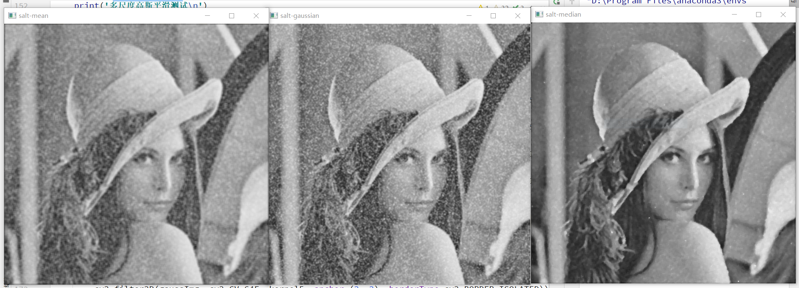
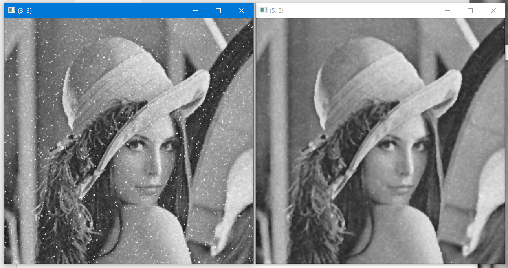

# 作业1 图像平滑

在这次作业中，我使用`python3.7`的环境，对平均平滑、高斯平滑、中值平滑进行了实现，并在多尺度方面进行了更多的实现核测试。

## 1. 实现$5 \times 5$模板的平均平滑、高斯平滑、中值平滑

### 1.1 平均平滑

平均平滑为一种线性滤波器，其对卷积模板内所有像素求平均，作为当前处理像素的值。以下为实现：

```python
def meanValueSmooth(img, kSize = (5, 5)):
    """
    均值平滑：取卷积模板内所有像素的均值为当前像素值。使用黑像素填充图像周围
    :param img: 图像数据，mat
    :param kSize: 卷积模板尺寸，正奇数
    :return: 平滑后的图像
    """
    print('平均平滑...')
    normWeight = kSize[0] * kSize[1]
    anchor = (int((kSize[0] - 1) / 2), int((kSize[1] - 1) / 2))
    tmplt = mat(np.ones((kSize[0], kSize[1]), dtype=float32)) / normWeight
    return cv2.filter2D(img, cv2.CV_8U, tmplt, anchor=anchor, borderType=cv2.BORDER_ISOLATED)
```

在此函数中，我对于图像边缘使用黑像素（灰度值为0）进行了扩充，保持滤波前后图像尺寸不变。

### 1.2 高斯平滑

高斯平滑的卷积模板基于二维高斯函数，具有各向同性，在任意一个一维方向都满足一维高斯分布。高斯平滑对卷积模板范围内的像素进行了加权，越靠近边缘权值越小。以下为实现：

```python
def gaussianSmooth(img, kSize=(5, 5)):
    """
    高斯滤波，调用cv2.GaussianBlur()实现
    :param img: 原图像
    :param kSize: 高斯核尺寸，width和height必须为正奇数
    :return: 滤波后的图像
    """
    print('高斯平滑...')
    res = mat(zeros((img.shape[0], img.shape[1]), dtype=uint8))
    cv2.GaussianBlur(img, ksize=kSize, sigmaX=0, dst=res)
    return res
```

同样的，对于图像边缘，我进行了扩充，保持图像尺寸不变。

### 1.3 中值平滑

中值平滑是一种非线性滤波，使用卷积模板范围内像素灰度值的中位数作为当前处理像素的灰度值，可以有效地消除某些突变点。以下为实现：

```python
def medianSmooth(img, kSize=(5, 5)):
    """
    中值滤波，取窗口内的中值为当前像素值
    :param img: 原图像
    :param kSize: 窗口尺寸，最好为正奇数
    :return: 平滑后的图像
    """
    print('中值平滑...')
    # 窗口的半部，简化后面运算
    littleHalf0 = (kSize[0] - 1) // 2
    littleHalf1 = (kSize[1] - 1) // 2
    greatHalf0 = kSize[0] - littleHalf0
    greatHalf1 = kSize[1] - littleHalf1
    # 首先图像扩充
    expansioned = cv2.copyMakeBorder(img, littleHalf0, littleHalf0,
                                     littleHalf1, littleHalf1,
                                     borderType=cv2.BORDER_ISOLATED)
    print('扩充前尺寸-' + str(img.shape) + ', 扩充后尺寸-' + str(expansioned.shape))

    # 计算
    dst = mat(np.zeros((expansioned.shape[0], expansioned.shape[1]), dtype=uint8))
    for i in range(littleHalf0, expansioned.shape[0]-littleHalf0):
        for j in range(littleHalf1, expansioned.shape[1]-littleHalf1):
            dst[i, j] = np.round(np.median(expansioned[i-littleHalf0: i+greatHalf0, j-littleHalf1:j+greatHalf1], ))

    return dst[littleHalf0: expansioned.shape[0]-littleHalf0, littleHalf1: expansioned.shape[1]-littleHalf1]
```

同样的，对于图像边缘，我进行了扩充，保持图像尺寸不变。

### 1.4 观察与总结

我使用一个高斯噪声图像，一个椒盐噪声图像，用$5 \times 5$的卷积模板分别实验了平均平滑、高斯平滑、中值平滑，实验结果如下：




从上到下为高斯噪声图像、椒盐噪声图像，从左至右分别为平均平滑、高斯平滑、中值平滑后的效果。可以看出，对于高斯噪声的图像，三个平滑器都有一定的效果，其中高斯滤波器的效果差些；对于椒盐噪声的图像，中值平滑器的效果尤其明显，这与其非线性的原理有关，不取决于所有卷积模板内的像素，只取决于中值，可以很好地去除过大过小点。

## 2. 构造不同尺寸的高斯卷积模板

高斯滤波的卷积模板构造基于二维高斯函数，公式为：


其可视化为：


实现如下：

```python
def constructGaussKernel(kSize=5, sigma=0):
    """
    构造高斯滤波卷积核，这里考虑简单情况，卷积核必须为方形
    若sigma为0，则使用kSize构造，认为μ+3σ外影响很小
    :param kSize:卷积核尺寸
    :param sigma:标准差。若sigma为0，则使用kSize构造，认为μ+3σ外影响很小，因此简单构造delta = (kSize+2)/6
    :return:
    """
    if kSize % 2 != 1:
        raise ValueError('卷积核尺寸应为正奇数')
    if sigma == 0:
        sigma = (kSize + 2) / 6
    print('计算高斯核...尺寸-' + str(kSize) + ', sigma-' + str(sigma))

    # 计算。前面的常系数省略不算，最后归一化即可
    sigma2 = sigma**2
    kernel = mat(np.zeros((kSize, kSize), dtype=float64))
    anchor = (kSize - 1) // 2
    total = 0
    for i in range(kSize):
        for j in range(kSize):
            kernel[i, j] = np.math.exp(-((i - anchor)**2 + (j - anchor)**2) / (2 * sigma2))
            total += kernel[i, j]

    return kernel / total
```

在实现中，我借鉴opencv的思路，加入判断，若标准差$\sigma$设置为0.则使用卷积核的尺寸计算合适的$\sigma$。通过计算可以得到，在(μ−3σ,μ+3σ)(μ−3σ,μ+3σ)范围内积分已经占99.7%，一般3σ外的数值已接近于0，可忽略。

## 3. 不同尺寸的高斯滤波

在这一部分，我选定一个多尺度平滑图像及一个高斯噪声图像，分别构造5x5、9x9、13x13、15x15的高斯滤波模板，然后对选定两个图像进行滤波。展示实验结果，并总结观察到的多尺度高斯平滑的特点。以下为实验结果：


上图为对多尺度平滑图像应用不同尺寸的高斯卷积核得到的结果，$\sigma$使用逻辑计算得到。可以看到，随着卷积核尺寸的增大，得到的图像的模糊度也增加，这是因为高斯滤波本质上是对像素周围的邻域做了加权平均，平均的范围越大，自然模糊度就越高。并且随着卷积核尺寸的增大，标准差$\sigma$也随之增大，这也会使属于原本像素的权重下降，增大模糊效果。


以上是对高斯噪声图像的测试，也可以看出相同的规律，就不继续赘述了。

## 4.不同尺寸的中值滤波

在这一部分，我选择一个椒盐噪声图像、分别进行3x3、5x5、7x7、9x9邻域的中值滤波，展示实验结果，并总结观察到的多尺度不同邻域的中值滤波特点。以下为结果：




可以看出，中值滤波器随着模板尺寸的加大，消除椒盐噪声的效果也越来越强，原因是椒盐噪声与周围像素的像素值完全无关，在中值滤波中，非常容易被排序至头尾两端，达到消除的作用。但是也可以看出，随着模板尺寸进一步加大，图像也出现了失真。因此消除椒盐噪声要选择一个合适的模板尺寸。

## 5. 总结

在本次实验中，我对于平均平滑、高斯平滑、中值滤波三种滤波器都进行了深入的探讨，并实现了其功能，实践了图像平滑的操作。