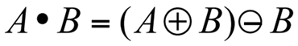
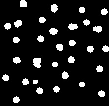

# SJTU-AU333-数字图像处理-作业三-形态学

**实验中完整代码和实验结果图像已发布，见 https://github.com/HahhForest/SmallProjects/tree/main/DigitalImageProcessing/%E5%BD%A2%E6%80%81%E5%AD%A6**

## 一、二值形态学

形态学图像处理的基本运算有4个：膨胀、腐蚀、开操作和闭操作。在这一节我们对二值图像运用二值形态学处理方法，以满足不同的要求。

### 1.1测试腐蚀、膨胀、开、闭运算

膨胀、腐蚀、开操作和闭操作是形态学中基础的运算，是很多其他方法的基础。

**膨胀**结果是这样一个由移位元素z组成的集合，以至B的反射对这些元素z移位操作的结果与A至少重叠一个元素，因此也可以表示成：

**腐蚀**结果是这样一个由移位元素z组成的集合，以至B对这些元素z位操作的结果完全包含于A：

**开运算**相当于先用结构元B对A腐蚀，再对腐蚀结果用同样的结构元进行膨胀操作。开运算通常在不改变形状的前提下，使图像的轮廓变得光滑，断开狭窄的间断，消除细的突出物：

**闭运算**相当于先用结构元B对A进行膨胀，再对膨胀结果用同样的结构元进行腐蚀操作，过程与开运算正好相反。 闭运算也是在不明显改变面积前提下，使图像的轮廓变得光滑，但与开运算相反，其作用是使断开部位和细长的沟熔合，填补轮廓上的间隙，消除小孔洞，填补轮廓线的断裂：

本次实验的图像原图如下：

可以看到，图形中有一些孔洞，同时图形的边缘有较细的突起和锯齿。以下为对图像进行膨胀、腐蚀、开操作和闭操作的结果：

使用7X7的掩膜五次膨胀

使用7X7的掩膜五次腐蚀

使用7X7的掩膜迭代五次开

使用7X7的掩膜迭代五次闭

可以看到，进行了**膨胀**后，图像中间的孔洞被填充变小，同时边缘向外扩展，使锯齿和细边缘变得圆润；使用**腐蚀**后，图像中间的孔洞扩大，边缘变细；使用**开操作**，相当于先腐蚀再膨胀，首先会使所有细的连接断掉，然后再膨胀使圆润，因此可以看到细的连接断开，而较粗的连接只是变得圆润；**闭操作**则相反，先膨胀后腐蚀，因此小的孔洞会被填充，而较大的孔洞只是变圆润。

### 1.3 去噪

原图像如图：

可以看出，主体是一行字母，噪声为一些黑色杂点。可以看出，相对于主体，噪声的尺寸相对较小。因此，可以采用开操作的思路，使用一个比噪声尺寸更大的掩膜对图像开操作，可以有效地去除尺寸较小的噪声，同时保持主体的尺寸不发生太大的变化。如下为采用$11 \times 11$的十字形掩膜，进行迭代一次的开操作的结果：

可以看出，绝大部分的噪声都被消除。此时我们发现图像中存在一些十字形锯齿。因此反色后再使用$5 \times 5$的椭圆形掩膜进行一次膨胀，结果如图：

可以看到，效果更加圆润。同时保持未出现新的噪声。

### 1.4 去除杆状结构

原图像如图：

可以看出，在原图像中，除了需要提取出的圆形主体，还有一些长棍形的不需要的形状。联想腐蚀操作的原理，我们可以使用较小的圆形的掩膜对图像进行腐蚀来消除棍状结构，再使用圆形掩膜进行膨胀，补偿圆形主体在腐蚀中的损失。即使用圆形掩膜进行开操作。

以下为使用$9 \times 9$的椭圆掩膜对原图像进行迭代为1次的开操作的结果：

可以看到，很好地去除了棍状结构，同时圆形主体的形状没有太多变化。

### 1.6 分离出水平垂直杆子

原图像如图：

可以看到，原图像中有水平的、竖直的、倾斜的杆状结构。与上一节的思路相同，我们使用对应形状的掩膜，对原图像进行开操作，就可以分离出对应的结构。

对应地定义掩膜：水平杆对应$15 \times 3$的矩形掩膜，竖直杆对应$3 \times 11$的矩形掩膜。使用以上掩膜分别对原图像进行迭代次数为1次的开操作，结果如图：

可以看到，很好地从原图像中分离出了水平和竖直的杆。

### 1.8 顶帽与黑帽操作

本次实验的要求为从左图得到右侧两个结果。原图像如下：

可以看到，需要得到的是在某些操作中会被消除的结构。两个结果中不同的是，第一个结果得到的是亮色部分延伸进暗色部分的锯齿，第二个结果是暗色部分延伸进亮色部分的锯齿。

结合开操作和闭操作，可以得到思路：开操作会使亮色边缘被抹平，因此使用原图像减去开操作的结果即可得到第一个结果，即：$f - (f \quad open \quad b)$。这也是顶帽运算的定义。

同样的，可以得到第二个结果的思路：闭操作会使暗色边缘被抹平。但由于其是由暗色被变换到亮色，因此要反过来使用闭操作的结果减去原图像，即：$(f \quad close \quad b) - f$，这也是黑帽运算的定义。

使用以上思路对原图像进行操作，其中开操作和闭操作的掩膜都是尺寸为$51 \times 51$的椭圆，迭代次数为1次。结果如图：

可以看出，很好地复原了要求，得到了暗背景上的亮物体和亮背景上的暗物体。

### 1.9 修复区域

原图像如下：

可以看出，主体为暗色背景上的亮色物体，含义为马。在主体的内部，有许多暗色的连接成线或块的噪声。

从原图像的特点上，我们可以得到思路：首先使用膨胀，将内部所有的空隙填满，然后再使用腐蚀，将主体边缘由于膨胀变形的轮廓修复回原有的形状。可以看出即是对原图像进行闭操作。

使用尺寸为$11 \times 11$的椭圆形掩膜对原图像进行迭代次数为1次的闭操作，结果如图：

可以看出，在很好地修复了图像中的缝隙的同时，还保持了原图形的形状，保留了原有的语义。

## 二、灰度形态学

在二值图像形态学的基础上，我们可以提出灰度形态学的概念。其中，在某处的灰度值不再是二值的，而是在0到255中的一个离散值。因此可以使用$f(x, y)$来表示图像的信息，其中$x, y$定义位置，$f$为离散函数，定义灰度值。

类似于二值形态学，定义某些基础操作如下：

**膨胀**运算是在由结构元素确定的邻域块中选取图像值与结构元素值的和的最大值，如果所有的结构元素的值是正的，则输出图像比输入图像更亮。暗的细节可被减少或消除，其程度依赖于这些暗细节的值和形状与结构元素间的关系。定义：

**腐蚀**操作是在由结构元素确定的领域块中选取图像值与结构元素值的和的最小值，如果所有的结构元素的值是正的，则输出图像比输入图像更暗。在比结构元素还小的区域中的亮细节效果将减弱，其程度依赖于环绕亮细节的灰度值，及结构元素的形状和幅度值。定义：

同样地，也可以定义灰度形态学的**开运算**和**闭运算**。

**开运算**通常用于去除小的（相对于结构元素而言）亮细节，而保留总体的灰度及和大的亮的特征不变。因为开始的腐蚀操作消除小的亮细节的同时也使图像变暗，所以后面的膨胀过程用于增加图像的整个强度，但不会再引入被去除的细节。定义：

**闭运算**通常用于去除小的（相对于结构元素而言）暗细节，同时相对保留亮特征不变。因为开始的膨胀操作消除暗细节的同时也使图像变亮，所以后面的腐蚀过程使图像变暗，但不会再引入被去除的细节。

### 2.2 去除高光区域后分割电话话筒

原图像如下：

可以看到，在图像中，主体为亮背景下的暗色主体。但是在主体中，包围有亮的高光噪声（裂隙）。因此，首先选用合适的阈值对原图像进行二值化并反色，使主体变为暗色背景下的亮区域。使用100为阈值二值化结果如下：

可以看到，二值化并反色后，话筒主体已经显现出来。但是在主体中还存在暗色的待修复区域。由前文的二值形态学实验，很容易想到思路为使用合适尺寸和形状的掩膜进行闭操作。使用$5 \times 5$的椭圆形掩膜，迭代次数为3次，进行闭运算后结果如下：

可以看到，最终的结果在去除了高光的情况下，成功地分离出了话筒的形状。

### 2.3 形态学滤除黑白噪声点后计算形态学梯度

原图像如下：

可以看到，在原图像上存在椒盐噪声，使其出现了许多黑白的噪声点。根据灰度形态学开运算的定义，开运算可以消除亮杂点，闭运算可以消除暗杂点。使用此方法，使用$7 \times 7$的椭圆形掩膜对原图像进行迭代次数为1的开运算和闭运算，结果如下：

可以看到，虽然有比较明显的涂抹痕迹，但是比较完美地消除了椒盐噪声。图像的形态学梯度定义如下：

使用此定义，得到消除椒盐噪声后的结果图像的形态学梯度：

### 2.4 顶帽运算与黑帽运算

原图像如下：

类似于二值图像的形态学，在灰度图像中也存在顶帽运算和黑帽运算，其定义类似：

**顶帽运算：**$f - (f \quad open \quad b)$

**黑帽运算：**$(f \quad close \quad b) - f$

使用顶帽运算可以得到亮色部分延伸进暗色部分的锯齿，黑帽运算可以得到暗色部分延伸进亮色部分的锯齿。使用$5 \times 5$的矩形掩膜，对原图像进行迭代次数为2次的开、闭运算后，相减得到顶帽运算结果与黑帽运算结果，二值化后的结果如下图：

可以看到，较好地分离了亮色边缘和暗色边缘。