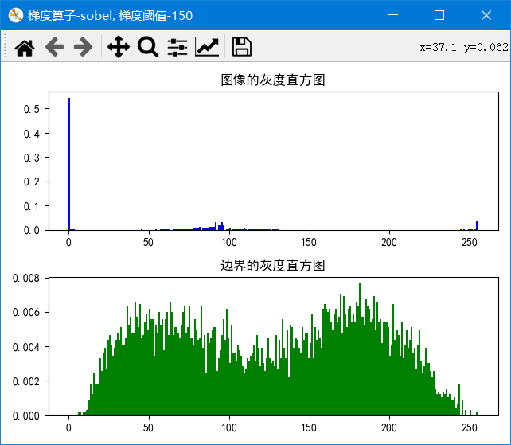

**SJTU-AU338-数字图像处理-大作业1 **
# 复现：Threshold selection by clustering gray levels of boundary, Pattern Recognition Letters 24 (2003) 1983–1999

**本实验所用完整代码已开源，见 https://github.com/HahhForest/SmallProjects/tree/main/DigitalImageProcessing/%E8%BE%B9%E7%95%8C%E7%81%B0%E5%BA%A6%E9%87%87%E6%A0%B7%E6%B3%95%E8%AE%A1%E7%AE%97%E9%98%88%E5%80%BC**

[TOC]

## 一、背景

### 1. 概念

+ 边界检测而非边缘检测
+ 边界检测方法：梯度约束的拉普拉斯检测零交叉
    1. $l(p_1) \cdot l(p_2) < 0$
    2. $g(p_1) + g(p_2) \geq 2 \cdot T$
+ 梯度约束的零交叉：不仅是零交叉，并且要满足两端点一阶导之和大于梯度阈值

### 2. 要求

+ 不同梯度阈值：梯度约束的零交叉中使用的阈值
+ 不同梯度计算模型：梯度约束的零交叉中用来计算梯度的模型
+ 传统拉普拉斯检测零交叉点：二阶导，去掉梯度约束

## 二、实现

使用`python3.7`，实现了包括梯度阈值约束的拉普拉斯检测、不同算子的梯度计算、沿图像边界的灰度值采样等功能。所有图像处理工具都写入类`ImgProcessor`中，以下为类定义：

```python
class ImgProcessor:
    """
    图像处理器
    在opencv中，图像以numpy.mat类型储存，因此打印尺寸信息为先高后宽。但在此类中，所有涉及到尺寸的表达方式均为先宽后高
    """
    def __init__(self, img, doGaussian=False, gaussKSize=(3, 3), gradientOpe='sobel', gTh=0):
        """
        :param img: 读入的图像数据，类型为numpy.mat，三通道彩色图像
        """
        print('初始化...')
        # 超参数
        # 是否进行高斯模糊
        self.doGaussian = doGaussian
        # 高斯模糊核尺寸，必须是正奇数
        self.gaussKSize = gaussKSize
        # 梯度计算的算子种类
        self.gradientOpe = gradientOpe
        # 找边界时的梯度阈值，设为0则为不使用梯度阈值约束
        self.gTh = gTh

        # 图像信息
        self.rgb = img
        # 图像尺寸
        self.width = img.shape[1]
        self.height = img.shape[0]
        # 填充后图像尺寸
        self.widthFilled = self.width + 2
        self.heightFilled = self.height + 2
        self.gray = self.rgb2gray()
        if self.doGaussian:
            self.gray = self.gaussianFilter()
        self.grayFilled = self.__edgeFill()
```

在报告中只列出主要函数，还有包括二值化等辅助函数，详见完整代码。

### 1.  灰度化

对于三通道的彩色图像，需要先将其灰度化为灰度图像，再进行图像处理。在实现中，使用人眼的敏感度对三个通道进行加权，使灰度图像更接近人眼的观感。

```python
    def rgb2gray(self):
        """
        彩色图像转为灰度图像，使用人眼的敏感度
        :return: 灰度图像，类型为num.mat
        """
        print('灰度化...')
        gray = mat(zeros((self.height, self.width), dtype=uint8))
        # 已经是灰度图
        if size(self.rgb.shape) == 2:
            return self.rgb
        # 单通道灰度图
        if self.rgb.shape[2] == 1:
            for i in range(self.height):
                for j in range(self.width):
                    gray[i, j] = self.rgb[i, j, 0]

        for i in range(self.height):
            for j in range(self.width):
                gray[i, j] = 0.11*self.rgb[i, j, 0] + 0.59*self.rgb[i, j, 1] + 0.3*self.rgb[i, j, 2]
        return gray
```

### 2. 高斯滤波

高斯滤波器是根据高斯函数的形状来选择权值的线性平滑滤波器。由于论文中的方法使用拉普拉斯算子进行检测，对噪声十分敏感，因此在类中实现了一个可调参数的高斯滤波器，可以选择在图像处理前使用，减少图像噪声。

```python
    def gaussianFilter(self):
        """
        高斯滤波，调用cv2.GaussianBlur()实现。源为
        :param kSize: 高斯核尺寸，width和height必须为正奇数
        :return: 滤波后的图像，和原函数同尺寸
        """
        print('高斯滤波...')
        res = mat(zeros((self.height, self.width), dtype=uint8))
        cv2.GaussianBlur(self.gray, self.gaussKSize, sigmaX=0, dst=res)
        return res
```

### 3. 拉普拉斯滤波

拉普拉斯算子是一种微分算子，用于对离散图像求二阶导数（微分）。根据图像边界的性质，图像的二阶导会在边界处形成零交叉点，这一性质可用于检测图像的边界。

```python
    def laplasian(self):
        """
        使用拉普拉斯算子计算图像的二阶导，使用填充过的图像
        计算出的拉普拉斯矩阵目的不是为了显示。若要使用imshow()显示应先将元素类型转换为uint8
        :return: 拉普拉斯矩阵，尺寸与原图像相同
        """
        print('拉普拉斯滤波...')
        # 拉普拉斯卷积模板
        lapFlt = mat(np.array([[0, 1, 0], [1, -4, 1], [0, 1, 0]]))
        res = cv2.filter2D(self.gray, cv2.CV_16S, lapFlt, anchor=(1, 1), borderType=cv2.BORDER_ISOLATED)

        return res
```

### 4. 梯度计算

梯度是对数字图像的变化程度的描述，使用一阶微分，不同的算子对梯度的方向和均匀性考虑不同。根据图像边界的性质，图像的一阶导会在边界处有较大的幅值，表现出边界图像变化剧烈的特点。因此在论文提出的“梯度幅值约束的拉普拉斯检测”方法中，对于边界的判断还加入了对于梯度的约束，希望以此来使得拉普拉斯检测的结果更精确。程序的实现中，梯度的幅值使用x、y方向的梯度幅值的绝对值之和近似计算，减少计算量。

```python
    def gradient(self):
        """
        计算图像的梯度，可以使用不同的算子，默认sobel
        :return: 梯度矩阵，与原图像同尺寸
        """
        print('梯度矩阵求解：算子-' + self.gradientOpe)
        if self.gradientOpe == 'robert' or self.gradientOpe == 'canny':
            return self.__gradient2()
        elif self.gradientOpe == 'prewitt' or self.gradientOpe == 'sobel':
            return self.__gradient3()
```

在程序中，我们实现了四种不同的梯度算子，`robert`，`canny`，`prewitt`，`sobel`，可以供选择。其中`robert`和`canny`算子的尺寸为$2 \times 2$，`prewitt`和`sobel`算子的尺寸为$3 \times 3$，在卷积的时候，前一种尺寸的算子与像素对齐点为左上角，后一种算子与像素的对齐点为中间，具体的实现如下：

```python
    def __gradient2(self):
        """
        使用尺寸为2的算子计算图像的梯度矩阵，对齐方式为左上角
        由于算子尺寸为偶数，因此依照定义，卷积核锚点设置为(0, 0)
        梯度幅度矩阵目的不是用来显示，因此若要显示查看效果，需将datatype改为uint8
        :param ope: 使用的算子
        :return: 图像的梯度幅度矩阵与方向矩阵，与原图像尺寸相同
        """
        kernelX = []
        kernelY = []
        theta = mat(np.zeros((self.height, self.width)))

        if self.gradientOpe == 'robert':
            kernelX = mat(np.array([[1, 0], [0, -1]]))
            kernelY = mat(np.array([[0, -1], [1, 0]]))
        elif self.gradientOpe == 'canny':
            kernelX = mat(np.array([[-1, 1], [1, 1]]))
            kernelY = mat(np.array([[-1, 1], [-1, -1]]))

        # 存浮点型，保证计算梯度方向时的精确度。使用cv2自带黑色补全
        gradientX = cv2.filter2D(self.gray, cv2.CV_16S, kernelX, anchor=(0, 0), borderType=cv2.BORDER_ISOLATED).astype(np.float16)
        gradientY = cv2.filter2D(self.gray, cv2.CV_16S, kernelY, anchor=(0, 0), borderType=cv2.BORDER_ISOLATED).astype(np.float16)
        for i in range(self.height):
            for j in range(self.width):
                theta[i, j] = math.atan2(gradientX[i, j], gradientY[i, j])

        # 以绝对值之和近似求梯度值
        gradientX = mat(np.maximum(gradientX, -gradientX))
        gradientY = mat(np.maximum(gradientY, -gradientY))
        magnitude = gradientX * 0.5 + gradientY * 0.5

        return magnitude, theta

    def __gradient3(self):
        """
        使用尺寸为3的算子计算图像的梯度矩阵，对齐方式为算子中心，即卷积核锚点设置为(1, 1)
        梯度幅度矩阵目的不是用来显示，因此若要显示查看效果，需将datatype改为uint8
        :param ope: 使用的算子
        :return: 图像的梯度幅度矩阵与方向矩阵，与原图像尺寸相同
        """
        kernelX = []
        kernelY = []
        theta = mat(np.zeros((self.height, self.width)))

        if self.gradientOpe == 'prewitt':
            kernelX = mat(np.array([[-1, 0, 1], [-1, 0, 1], [-1, 0, 1]]))
            kernelY = mat(np.array([[1, 1, 1], [0, 0, 0], [-1, -1, -1]]))
        elif self.gradientOpe == 'sobel':
            kernelX = mat(np.array([[-1, 0, 1], [-2, 0, 2], [-1, 0, 1]]))
            kernelY = mat(np.array([[1, 2, 1], [0, 0, 0], [-1, -2, -1]]))

        # 存浮点型，保证计算梯度方向时的精确度。使用cv2自带黑色补全
        gradientX = cv2.filter2D(self.gray, cv2.CV_16S, kernelX, anchor=(1, 1), borderType=cv2.BORDER_ISOLATED).astype(np.float16)
        gradientY = cv2.filter2D(self.gray, cv2.CV_16S, kernelY, anchor=(1, 1), borderType=cv2.BORDER_ISOLATED).astype(np.float16)
        for i in range(self.height):
            for j in range(self.width):
                theta[i, j] = math.atan2(gradientX[i, j], gradientY[i, j])

        # 以绝对值之和近似求梯度值
        gradientX = mat(np.maximum(gradientX, -gradientX))
        gradientY = mat(np.maximum(gradientY, -gradientY))
        magnitude = gradientX * 0.5 + gradientY * 0.5

        # cv2.imshow('mag', magnitude.astype(uint8))
        # cv2.waitKey(100000)
        return magnitude, theta
```

### 5. 边界灰度值采样

在得到前面的拉普拉斯滤波矩阵和梯度幅值矩阵后，就可以使用论文中的“梯度约束的拉普拉斯检测”方法，对边界灰度值进行采样。在实现中简单考虑所有相邻两个像素组成的边，对这些边检测是否有边界穿过，若有则线性插值出灰度值，采样。

```python
    def grayValueAlongBoundary(self):
        """
        使用梯度约束的拉普拉斯检测得到边界
        考虑相邻的四个像素组成的小方格。对其四条边进行检测是否与边界相交。若出现二阶导即拉普拉斯值零交叉且梯度之和大于等于梯度阈值，认为与边界相交
        若一个小方格中有至少两条边检测相交，则认为此方格为“边界方格”。通过插值计算相交点的灰度值。绘制相交点的灰度值直方图，即可看到对应的最佳阈值
        设置梯度阈值gTh <= 0即为不使用梯度阈值
        :return: 灰度值列表，可以用来取平均求最优阈值和画直方图
        """
        # 边界灰度值采样列表
        print('边界灰度值采样：梯度阈值-' + str(self.gTh))
        sampleLst = []
        # 拉普拉斯矩阵、梯度值矩阵、梯度方向矩阵
        lapMat = self.laplasian()
        gMagMat, gDirMat = self.gradient()

        # 横向边检测，遍历左端点
        for i in range(self.height):
            for j in range(self.width - 1):
                if ((lapMat[i, j] > 0 and lapMat[i, j + 1] < 0) or (lapMat[i, j] < 0 and lapMat[i, j + 1] > 0))\
                        and gMagMat[i, j] + gMagMat[i, j + 1] >= self.gTh:
                    w = float(abs(lapMat[i, j + 1])) / (abs(lapMat[i, j]) + abs(lapMat[i, j + 1]))
                    sampleLst.append(self.gray[i, j] * w + self.gray[i, j + 1] * (1-w))

        # 纵向边检测，遍历上端点
        for j in range(self.width):
            for i in range(self.height - 1):
                if ((lapMat[i, j] > 0 and lapMat[i + 1, j] < 0) or (lapMat[i, j] < 0 and lapMat[i + 1, j] > 0)) \
                        and gMagMat[i, j] + gMagMat[i + 1, j] >= self.gTh:
                    w = float(abs(lapMat[i + 1, j])) / (abs(lapMat[i, j]) + abs(lapMat[i + 1, j]))
                    sampleLst.append(self.gray[i, j] * w + self.gray[i + 1, j] * (1 - w))

        print('采样点个数-' + str(size(sampleLst)) + ', 均值-' + str(mean(sampleLst)))
        return sampleLst
```

### 6. 绘制直方图

绘制图像的灰度直方图与边界采样灰度直方图，对比检测论文提出方法的效果。

```python
    def drawHistogram(self, normed=True):
        """
        绘制直方图，分别为图像的灰度直方图以及边界的灰度直方图
        :param normed: 纵坐标是否使用密度比例
        """
        print('绘制直方图...')
        boundaryGrayLst = self.grayValueAlongBoundary()
        grayRange = list(range(256))

        plt.figure('梯度算子-' + self.gradientOpe + ', 梯度阈值-' + str(self.gTh))
        # 图像的灰度直方图子图
        plt.subplot(2, 1, 1)
        imgGrayLst = list(self.gray.flatten().A)
        plt.hist(imgGrayLst, bins=grayRange, density=normed, color='blue')
        plt.title('图像的灰度直方图')

        # 边界灰度直方图子图
        plt.subplot(2, 1, 2)
        plt.hist(boundaryGrayLst, bins=grayRange, density=normed, color='green')
        plt.title('边界的灰度直方图')

        # 自动调整子图距离
        plt.tight_layout()
        plt.show()
```

## 三、与论文中结果进行比较

在这一节中，我们与论文中对应的实验结果进行比较，检验复现效果。

### 1. 腿部CT图边界采样阈值提取与多阈值分割

如图，为一腿部灰度CT图像：


可以看出，图像具有多层次的特点。我们使用论文中的方法，得到了图像的灰度直方图（上）以及边界的灰度直方图（下）。使用的参数为加入高斯滤波，卷积核尺寸$3 \times 3$，梯度算子`sobel`，梯度阈值60。统计得边界采样点共5680个，灰度均值为73.284：


从直方图中可以看出，选择了合适的梯度阈值后，沿边界采样的灰度值的中心很好地对应了图像的灰度直方图的”山谷“处。以这些灰度值来进行阈值分割，会得到比较好的结果。我们以其聚类中心25、68、170作为阈值，对图像进行分割，结果如图：


可以看出，非常好地分割出了图像的各个部位。这三幅图像是使用简单的二值化得到的，论文中的四幅图片中的第二幅是在这三幅图片的基础上以反色、叠加等手段处理出来的，在这里就不继续实现了。

### 2. 头部CT图边界采样阈值提取与多阈值分割

类似的，我们使用头部CT图像进行测试，结果如图。可以看到和上一例子一样，复现的很完美。使用的参数为加入高斯滤波，卷积核尺寸$3 \times 3$，梯度算子`sobel`，梯度阈值280。统计得边界采样点共3153个，灰度均值为139.99：


使用边界采样灰度值聚类，得到两个阈值50、170.使用这两个阈值进行分割，二值化结果如图：


同样的，可以看出，非常好地分割出了图像的各个部位。

## 四、对比实验

根据要求，我从不同梯度阈值对比、不同梯度计算模型对比、梯度约束的Laplacian检测与直接Laplacian检测对比几个方面进行了对比实验。同时为了检测加上高斯滤波器的优化效果，还对加入高斯滤波降噪与不进行进行了对比实验。在对比实验中，使用腿部CT图像进行测试


### 1. 不同梯度阈值对比

在实验中我们发现，在一定的范围内，选择不同梯度阈值时，对边缘检测结果的影响以及对阈值计算结果的影响不大。但是若离最优梯度阈值太远，还是会影响到效果。在这里我们使用腿部CT图像进行对比试验，设置超参数：不加入高斯滤波，梯度算子`sobel`，梯度阈值从100以步长100变化到350。实验结果如图：





可以看出，梯度幅值的范围在200到350的大范围内，效果都非常稳定；但是在200以下，因为偏离太远，效果会有明显的差距。总的来说，梯度过小，会使采样点过多，采样点的灰度直方图表现出趋向整个图像的灰度直方图，无法起到找合适的分割阈值的作用；梯度阈值过大，采样点过少，表现出的特征过于依赖某些采样点，表现不出整个图像的特征，效果也不好。

### 2. 不同梯度计算模型对比

在这一节进行对比试验，观察采用不同梯度计算模型（robert、sobel、prewitt、canny）时，对结果是否有影响。在这里我已经提前测试好了采用不同的模型的最佳阈值，不使用高斯滤波，参数和结果如下：

```python
gradientOpeLst = ['robert', 'canny', 'prewitt', 'sobel']
optGThLst = [50, 420, 200, 300]
```


可以看出，在使用了合适的梯度阈值后，不同的梯度算子除canny外检测效果都比较好，原因可能是测试图像的边界是一个封闭的凸曲线，在各个方向都有很好的体现。而canny算子可以看出明显边界采样的波峰有一个偏移，我认为原因是其算子尺寸为偶数，因此卷积时会有一个偏移，体现在直方图上就是采样的曲线与实际的边界曲线有一个飘逸，导致直方图也出现整体的漂移。

### 3. 梯度约束的Laplacian检测与直接Laplacian检测对比

在本节中观察直接用Laplacian算在在图像中检测零交叉与采用本文方法计算（梯度约束的Laplacian检测）的零交叉在分布上存在哪些不同。设置超参数：不加入高斯滤波，梯度算子`sobel`，梯度阈值为350（对应加入梯度约束）与0（对应不加梯度约束）。结果如下：


可以看到，不加梯度约束，得到的采样灰度直方图十分接近整个图像的灰度直方图。原因应该是拉普拉斯检测对于噪声太过敏感，导致采样实际上变成了对整个图像的采样。

### 4. 进行高斯滤波降噪与不进行对比

最后，我们还测试了加入高斯滤波对结果的影响。高斯滤波可以很好地消除噪声，我们认为加入后对于拉普拉斯检测的结果也有提升作用。设置超参数：

```python
processor.setHyperPara(doGaussian=False, gradientOpe='sobel', gTh=300)
processor.setHyperPara(doGaussian=True, gaussKSize=(3, 3), gradientOpe='sobel', gTh=300)
processor.setHyperPara(doGaussian=True, gaussKSize=(5, 5), gradientOpe='sobel', gTh=200)
processor.setHyperPara(doGaussian=True, gaussKSize=(7, 7), gradientOpe='sobel', gTh=200)
```

试验了不加高斯滤波以及不同的卷积核尺寸的影响。梯度阈值有一定的调整。结果如下：


可以看出，加入高斯滤波后，边界采样灰度直方图中”谷“和”峰“更加明显。而调大高斯滤波卷积核的尺寸，对梯度阈值进行适当调整，则能得到差不多的效果。

## 五、总结

在本次实验中，我复现了论文中的算法，并测试了复现的效果。同时，对于算法中一些关键部分，进行了对比试验。通过这次实验，我实践了基础的数字图像处理方法，了解到了一些其他的优化思路。


