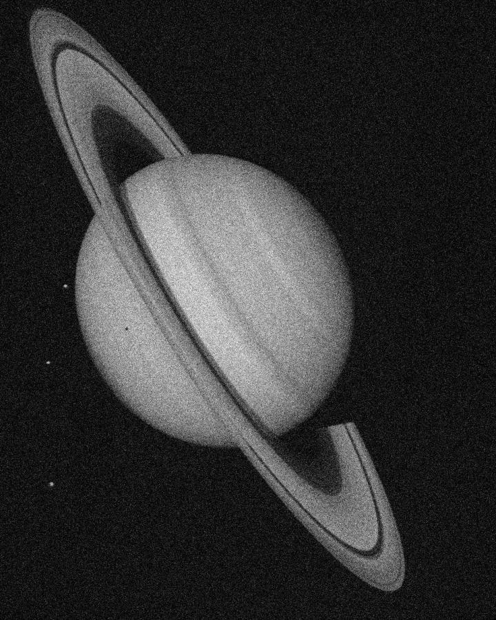
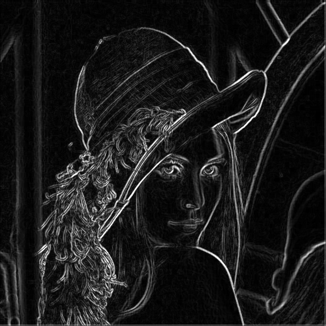
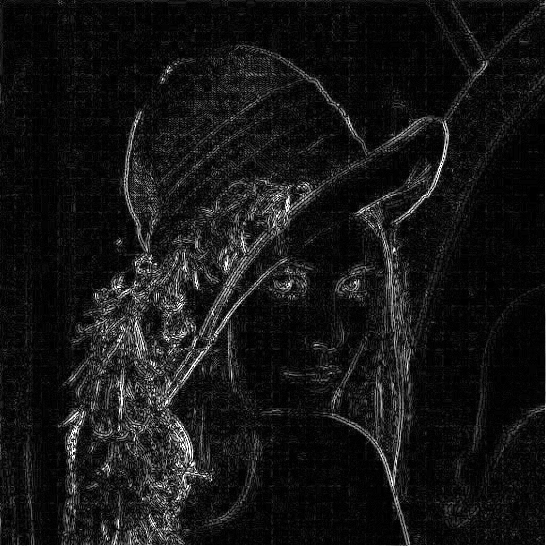
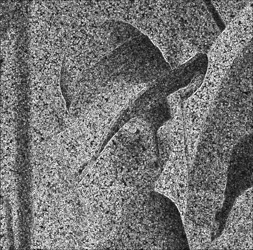
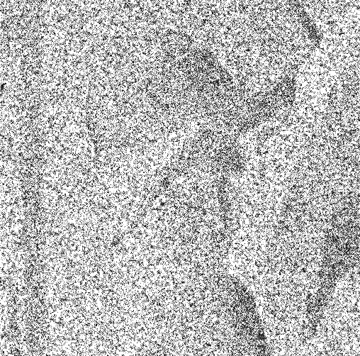
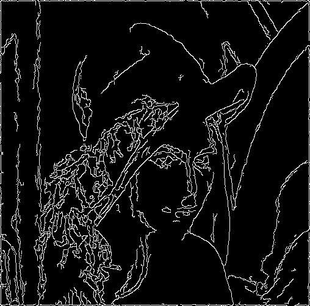

# 作业2 边缘检测

在本次实验中，我们在上一次实验得到的多尺度高斯平滑的基础上，分别使用sobel、Lapalcian、高斯-Laplacian（Marr算子）、Canny算子进行边缘检测。

## 一、实验结果展示

我选取了多尺度平滑图像、高斯噪声图像的5x5、9x9、13x13、15x15的高斯滤波后的图像，分别使用sobel、Lapalcian、高斯-Laplacian（Marr算子）、Canny算子进行边缘检测。以下为原图像：




在以下的结果展示中，除了canny算子的边缘检测，其余算子的方法中都没有加入二值化，因为最后的检测结果会受到二值化阈值的影响。为了能够更好地对比各个算子之间的异同，这里展示的是裸的梯度图像。以30为阈值二值化后的图像见仓库目录`./BiRes`。

### 1.1 5x5高斯平滑

#### 1.1.1 多尺度平滑图像

**sobel算子**

-sobel-1622375251319.jpg)

**拉普拉斯算子**

-lap-1622375257326.jpg)

**LoG（高斯-Laplacian）算子**

-LoG-1622375263022.jpg)

**canny算子**

-canny-1622375267201.jpg)

#### 1.1.2 高斯噪声图像

**sobel算子**

-sobel-1622375271748.jpg)

**拉普拉斯算子**

-lap-1622375277446.jpg)

**LoG（高斯-Laplacian）算子**

-LoG-1622375281471.jpg)

**canny算子**

-canny-1622375294262.jpg)

### 1.2 9x9高斯平滑

#### 1.2.1 多尺度平滑图像

**sobel算子**

-sobel-1622375317170.jpg)

**拉普拉斯算子**

-lap.jpg)

**LoG（高斯-Laplacian）算子**

-LoG.jpg)

**canny算子**

-canny.jpg)

#### 1.2.2 高斯噪声图像

**sobel算子**

-sobel-1622375332008.jpg)

**拉普拉斯算子**

-lap.jpg)

**LoG（高斯-Laplacian）算子**

-LoG.jpg)

**canny算子**

-canny.jpg)

### 1.3 13x13高斯平滑

#### 1.3.1 多尺度平滑图像

**sobel算子**

-sobel-1622375089018.jpg)

**拉普拉斯算子**

-lap.jpg)

**LoG（高斯-Laplacian）算子**

-LoG.jpg)

**canny算子**

-canny.jpg)

#### 1.3.2 高斯噪声图像

**sobel算子**

-sobel-1622375132008.jpg)

**拉普拉斯算子**

-lap.jpg)

**LoG（高斯-Laplacian）算子**

-LoG.jpg)

**canny算子**

-canny.jpg)

### 1.4 15x15高斯平滑

#### 1.4.1 多尺度平滑图像

**sobel算子**

-sobel-1622375168473.jpg)

**拉普拉斯算子**

-lap.jpg)

**LoG（高斯-Laplacian）算子**

-LoG.jpg)

**canny算子**

-canny.jpg)

#### 1.4.2 高斯噪声图像

**sobel算子**

-sobel-1622375220056.jpg)

**拉普拉斯算子**

-lap.jpg)

**LoG（高斯-Laplacian）算子**

-LoG.jpg)

**canny算子**

-canny.jpg)

## 二、总结与分析

### 2.1 总结多尺度表示图像系列中边缘检测结果的变化特点

以canny算子检测为例，以下为使用逐渐增大的高斯模板滤波后再canny检测的结果：

-canny-1622377922154.jpg)

-canny-1622377927358.jpg)

-canny-1622377933446.jpg)

-canny-1622377955713.jpg)

可以看出，随着高斯滤波的模板尺寸逐渐增大，图像中的噪声也越来越少，结果更加精确简洁。但是，在模板尺寸过大后，也可以看出，检测的结果信息丢失太严重，边缘检测的效果反而有下降。

### 2.2 总结sobel、Lapalcian算子的边缘检测结果的差异性

以下为5x5高斯模糊后，使用sobel算子与拉普拉斯算子的边缘检测二值化后的结果，梯度阈值都是30：

-sobel-1622378198331.jpg)

-lap-1622378223805.jpg)

-sobel-1622378240212.jpg)

-lap-1622378247162.jpg)

可以看出由于sobel算子不是各向同性的，其结果是由x、y两个方向的算子计算后叠加而成的，而拉普拉斯算子是各向同性的，因此sobel算子的结果中，边缘连接得更好，而拉普拉斯算子的结果中，噪声较多，对噪声敏感，边缘也不是连通的，而是以密度更大的散点图形式存在。

### 2.3 总结Lapalcian、高斯-Laplacian（Marr算子）的边缘检测结果的差异性

以下为5x5高斯模糊后，使用拉普拉斯算子与LoG算子的边缘检测二值化后的结果，梯度阈值都是30：

-lap-1622378538442.jpg)

-LoG-1622378547966.jpg)

-lap-1622378552634.jpg)

-LoG-1622378556502.jpg)

由于LoG算子是在拉普拉斯算子检测前，加入了高斯平滑，因此从结果我们也可以看出，LoG算子的检测结果相对于拉普拉斯算子的来说，噪声更少，边缘更突出。但也可以看出，由于使用了高斯平滑，LoG算子的结果中，边缘较粗较模糊

### 2.4 总结sobel、Canny算子的边缘检测结果的差异性

以下为5x5高斯模糊后，使用sobel算子与canny算子的边缘检测二值化后的结果，sobel算子梯度阈值为30，canny中高阈值为110，低阈值为40：

-sobel-1622378881952.jpg)

-canny-1622378888542.jpg)

-sobel-1622378894226.jpg)

-canny-1622378898701.jpg)

从结果中可以看出，canny算子的结果相比于sobel算子更加精确，边缘更细，噪声更少。这是由于canny检测加入了非极大值抑制和双阈值法连接边缘，使用梯度的方向来去掉了很多梯度很大但却不是边缘的点，用双阈值使边缘更加简洁。这都是sobel算子单单使用梯度计算和阈值过滤所无法产生的效果。

### 2.5 在sobel、Canny算子中选用不同的梯度阈值，总结边缘检测结果的变化特点

梯度设置：

```python
thLst = [40, 70, 100, 130, 160]
```

sobel算子结果：

-sobel.jpg)

-sobel-1622380809385.jpg)

-sobel-1622380812400.jpg)

-sobel-1622380815404.jpg)

-sobel-1622380818294.jpg)

可以看出，对于sobel算子检测，梯度阈值越高，被检测为边缘的点就越少。在一定范围内，这可以使边缘更加精确，去除掉噪点，但超过合适的范围，会使边缘点过少而导致边缘检测效果不佳。

阈值设置：

```python
lowThLst = [10, 40, 70, 40, 40]
highLst = [110, 110, 110, 80, 140]
```

canny边缘检测结果：

-sobel.jpg)

-sobel.jpg)

-sobel.jpg)

-sobel.jpg)

-sobel.jpg)

可以看出，由于双阈值法的存在，一定范围内提高低阈值，可以有效地抑制噪声；提高高阈值，可以使更多的边缘是靠连接得来，使边缘更加精确。

## 三、椒盐噪声与sobel、拉普拉斯算子边缘检测

### 3.1 实验结果

以下为梯度图像展示，未使用梯度阈值进行二值化

无噪声、sobel



无噪声、拉普拉斯



椒盐噪声、sobel



椒盐噪声、拉普拉斯



### 3.2 总结2个边缘检测算子在两幅图像中边缘检测结果的差异性, 说明噪声对边缘检测结果的影响

sobel算子带有平滑效果，而拉普拉斯算子对于噪声十分敏感；sobel算子不是各向同性的，而拉普拉斯算子是各向同性的；sobel算子是一阶差分，拉普拉斯算子是二阶差分。因此可以看出，没有噪声时，sobel算子结果中噪声更少，边缘连接更好。

加入椒盐噪声后，可以看到两个算子的效果都不好。原因是加入噪声在图像中均匀地提高了某些点的梯度，因此无论是检测梯度的sobel算子，还是使用二阶微分检测零交叉点的拉普拉斯算子，结果都会受到很大的影响。

### 3.3 如果要在包含椒盐噪声的“噪声图像-有椒盐噪声.jpg”中得到好的边缘检测结果，需要怎样操作

我认为首先加入中值平滑。在上一次图像平滑的实验中，我们发现，使用非线性的中值平滑，对于消除椒盐噪声有很大的作用。其次可以使用一些更加精确的算法，如canny检测算法等，它不仅仅依赖于局部的梯度，其使用的非极大值抑制考虑了梯度的方向，使结果更加精确；使用的双阈值法在使用高阈值提取出主要边缘后，使用连接的方式在待选区中寻找点构造边缘，效果肯定优于直接用梯度阈值的方法。以下为使用$7 \times 7$的中值平滑后再canny检测的结果：



可以看出，很大的减少了椒盐噪声的影响，得到了较好的结果。